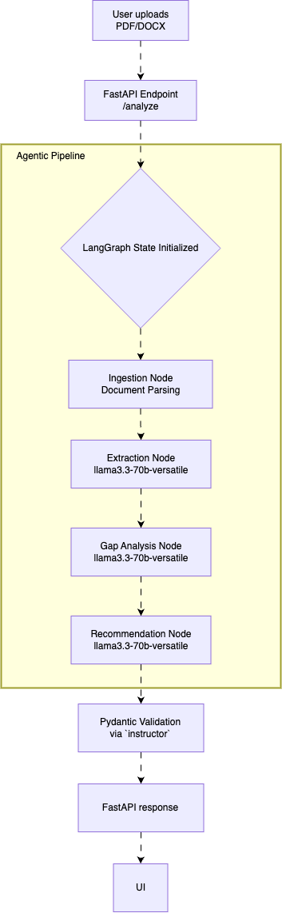

# System Architecture & Design

## 1. Overview and Purpose
This document details the architectural design and technology stack behind the AI-Powered Resume Screener MVP. Unlike a traditional Retrieval-Augmented Generation (RAG) system that relies on vector similarity to match candidates to roles, this project takes a **Structured Agentic Workflow** approach.

The goal of this system is to evaluate candidate resumes against specific Job Description (JD), extracting structured criteria natively and scoring candidates based on qualifications.

### High-Level Architecture

---

## 2. Core System Components Flow
The core logic of the application operates sequentially. Rather than a monolithic LLM call, the workflow is broken down into modular, single-purpose steps to improve accuracy, traceability, and latency control.

1. **Ingestion Layer:**
   - **Input:** Raw Job Description (PDF/TXT) and Resume (PDF/DOCX).
2. **The LangGraph StateGraph (Pipeline Layer):**
   - The State object flows through distinct nodes. Each node performs a specific function and updates the shared State.
   - **Node 1: Parser:** Given the raw documents, this node utilizes tools (`pdfplumber`, `python-docx`) to extract and clean the raw text strings.
   - **Node 2: Extractor:** Given the parsed JD, this node extracts key responsibilities, required skills, and nice-to-have skills into a structured JSON payload.
   - **Node 3: Analyzer:** Given the extracted candidate data and the JD criteria, this node performs a gap analysis, identifying matching skills and missing qualifications.
   - **Node 4: Recommender:** Based on the analysis, this final node determines the candidate's fit score (e.g., 0-100) and produces a concise hiring recommendation.
3. **Serving Layer:**
   - A **FastAPI** backend exposes the LangGraph pipeline via an `/analyze` endpoint.
4. **Presentation Layer:**
   - A **Streamlit** UI provides a simple frontend for users to upload their documents and view the structured results.

---

## 3. Technology Stack Justifications

### 3.1 Orchestration Framework: LangGraph vs. LangChain Chains
While traditional LangChain sequential chains *could* handle this flow, I chose **LangGraph**. LangGraph forces a structured, typed `State` object that gets explicitly modified at each step. This makes debugging much easier (you can inspect the state before it hits the Recommender node) and lays the groundwork for adding cyclic agent loops in future iterations (Stretch Goals).

### 3.2 Key Design Decision: LLM Nodes vs. Autonomous Agents
For the initial MVP, the LangGraph nodes act as deterministic **LLM Nodes** rather than autonomous "Agents." 

*Why?*
- **Linear Reasoning vs. Loop Complexity:** The problem (Extract $\rightarrow$ Analyze $\rightarrow$ Recommend) is a linear pipeline. An autonomous agent usually implies an LLM deciding *which* tool to call, or looping until an observation satisfies a condition. Since my process is a straight line, deterministic nodes are vastly more efficient.
- **Latency Control (Target < 15s):** Autonomous agents run the risk of getting stuck in "thought loops" or calling tools repeatedly, spiking latency and cost. By locking the model into a strict sequential flow, I guarantee consistent execution times.
- **Use Case for Full Agents (Stretch Goal):** If I expand the system to actively search the internet (e.g., "Find this candidate's GitHub to verify Python experience"), checking if enough information has been found would warrant a true Agent loop.

### 3.3 The LLM Layer
- **Model Choice:** OpenAI's `gpt-4o-mini` (or equivalent models like `Claude 3.5 Haiku`). 
- **Justification:** Since the task relies heavily on following instructions to produce structured JSON outputs (via Pydantic schemas) quickly, I preferred these highly capable, low-latency, and cost-effective models over heavier reasoning models (like `gpt-4o` or `Claude 3.5 Sonnet`).

### 3.4 API & UI Stack
- **FastAPI:** Chosen for its native asynchronous capabilities, automatic Swagger documentation, and seamless integration with Pydantic for input validation.
- **Streamlit:** Chosen for rapid minimum viable product (MVP) UI creation, allowing me to build a functional frontend that handles file uploads purely in Python without writing React/HTML.

### 3.5 Data Ingestion & Parsing Strategy
- **PDF Extraction (PyMuPDF):** Standard parsers (like `pdfplumber`) extract text strictly by Y-coordinates, which destroys the semantic flow of two-column resumes (merging unrelated columns line-by-line). I chose `PyMuPDF` (`fitz`) for its ability to extract text as logical blocks (`page.get_text("blocks")`), preserving the true reading order and column structures necessary for structured LLM comprehension.
- **DOCX Extraction (python-docx):** I discovered that standard paragraph iteration blind-spots hidden Word tables, which are commonly used for formatting "Skills" sections. Furthermore, extracting tables sequentially *after* paragraphs tacks them onto the bottom of the text, destroying the document's logical hierarchy. The ingestion pipeline is designed to explicitly crawl the underlying document elements to extract paragraphs and tables in their exact visual sequential order.

---

## 4. Key Risks and Mitigations Overview
*(See [`docs/risks_and_mitigations.md`](docs/risks_and_mitigations.md) for full details)*

- **Output Parsing Failures:** Mitigated by using strict Pydantic models in the LLM requests and retry logic for malformed JSON.
- **Hallucination:** Mitigated by separating extraction and analysis into separate nodes. The model is forced to *cite* the resume when making a claim in the Analyzer node before generating the final recommendation.
